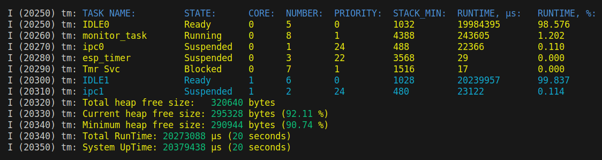

[](LICENSE)
[](https://github.com/VPavlusha/ESP32_Task_Monitor/actions/workflows/cpp-linter.yml)
[](https://github.com/VPavlusha/ESP32_Task_Monitor/releases)
[](https://stand-with-ukraine.pp.ua)
[](https://stand-with-ukraine.pp.ua)
---

# ESP32 Task Monitor
The ESP32 Task Monitor is a project that provides a simple way to monitor the tasks running on an ESP32 microcontroller in real-time. The project provides a tool for developing and debugging complex embedded systems.

#### Table of Contents
&emsp;[1. Features](#1-features)  
&emsp;[2. ESP32 Task Monitor](#2-esp32-task-monitor)  
&emsp;[3. Basic Usage](#3-basic-usage)  
&emsp;[4. Getting Started](#4-getting-started)  
&emsp;[5. Example](#5-example)  
&emsp;[6. Contributing](#6-contributing)  
&emsp;[7. License](#7-license)  

## 1. Features
  - ESP-IDF v5.3-dev-422-ga7fbf452fa 2nd stage bootloader
  - Real-time monitoring of running multiple tasks for ESP32 microcontrollers.
  - Written in C language.
  - MIT License.

## 2. ESP32 Task Monitor


## 3. Basic Usage
**NOTE:** configUSE_TRACE_FACILITY and configGENERATE_RUN_TIME_STATS must be defined as **1** in FreeRTOSConfig.h for this API function task_monitor() to be available.
```C
// 1. Include header:
#include "task_monitor.h"

void app_main(void)
{
    // 2. Start task monitor:
    task_monitor();
}
```
## 4. Getting Started
To get started with the ESP32 Task Monitor project, you'll need an ESP32 microcontroller and a host computer running Python. You'll also need to install the ESP-IDF development framework and the required Python packages.

### 4.1 Clone the project repository:
```C
    git clone https://github.com/VPavlusha/ESP32_Task_Monitor.git
```
### 4.2 Build the project:
```C
    cd ESP32_Task_Monitor
    idf.py build
```
### 4.3 Flash onto your ESP32 microcontroller:
```C
    idf.py -p PORT [-b BAUD] flash
```
Replace PORT with your ESP32 board’s serial port name.
You can also change the flasher baud rate by replacing BAUD with the baud rate you need. The default baud rate is 460800.<br/>
### 4.4 Monitor the output:
```C
    idf.py -p <PORT> monitor
```
Do not forget to replace PORT with your serial port name.

More information how to build project: [ESP-IDF Programming Guide](https://docs.espressif.com/projects/esp-idf/en/v5.0.1/esp32/get-started/start-project.html).

## 5. Example
This project includes an [example](https://github.com/VPavlusha/ESP32_Task_Monitor/tree/main/main) that showcases the functionality of the Task Monitor library. This example provides a practical demonstration of how to use the Task Monitor API to monitor tasks in your own applications.

## 6. Contributing
Contributions to the ESP32 Task Monitor project are welcome. If you find a bug or have a feature request, please submit an issue on the project's GitHub page. If you'd like to contribute code, please submit a pull request.

## 7. License
The ESP32 Task Monitor project is licensed under the MIT License. See the [MIT license] file for more information.
  
  [MIT license]: http://www.opensource.org/licenses/mit-license.html
